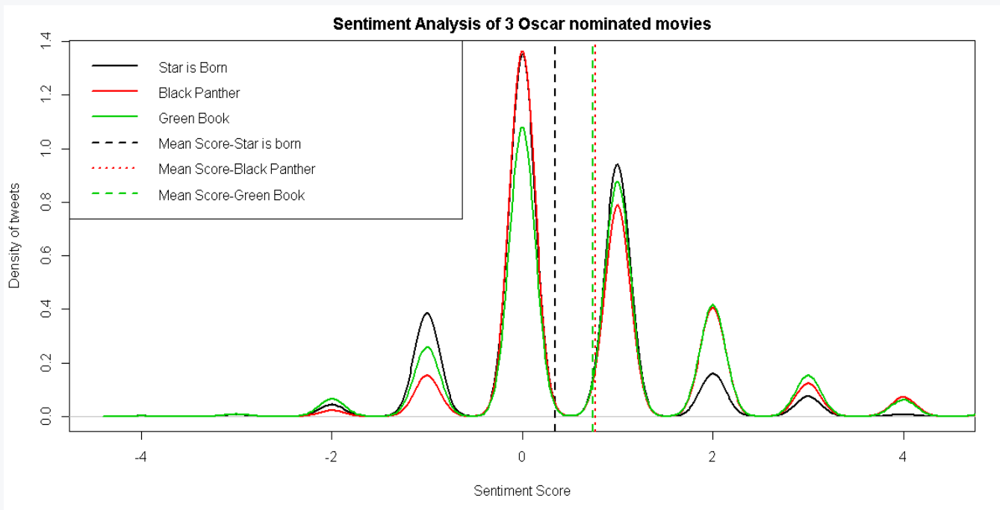
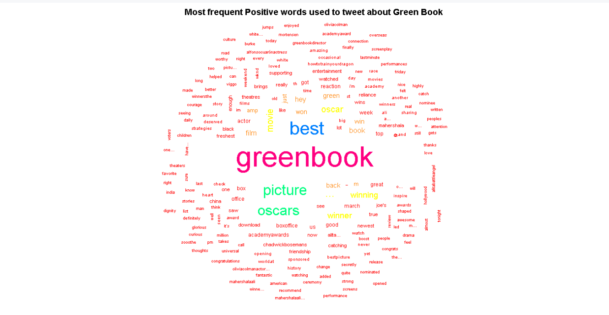

# Twitter-Sentiment-Analysis (R Project)

### Methodology:
* Scrapped tweets about 3 oscar nominated best picture movies from twitter using the twitter API and saved it as a Rdata file
* Estimated sentiment of each tweet by considering each tweet as a "bag of words" and matching each word against two files consisting of positive and negative words (positive-words.txt and negative-words.txt).
* To assign a numeric score to each tweet, the number of occurrences of negative words is substracted from the number of positive words. Larger negative scores will correspond to more negative expressions of sentiment, neutral (or balanced) tweets should net to zero, and very positive tweets should score larger, positive numbers.
* A published "opinion lexicon" is used as the dictionaries of positive and negative words. It categorizes approximately 2000 words as positive (e.g. love, best, great, amazing), and approximately 4800 words as negative (e.g. hate, worst, sucks, nightmare).

### Results:

* The distributions of sentiment scores for each of the three movies was plotted. A vertical line is added to indicate the mean sentiment score.
The score distributions are compared by placing them all in the same figure.

* For the movie with the most positive sentiment, a word cloud was made

